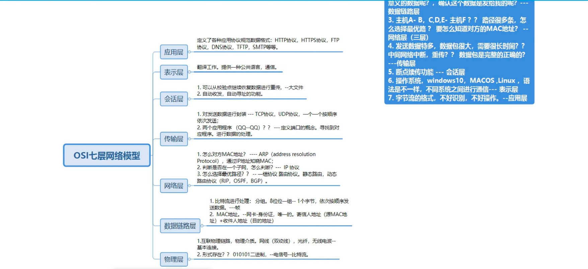
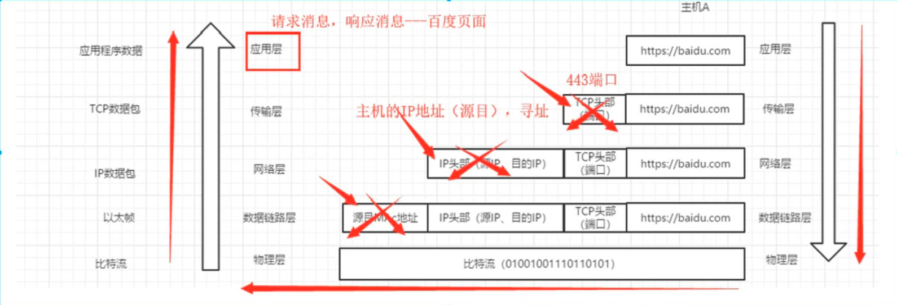
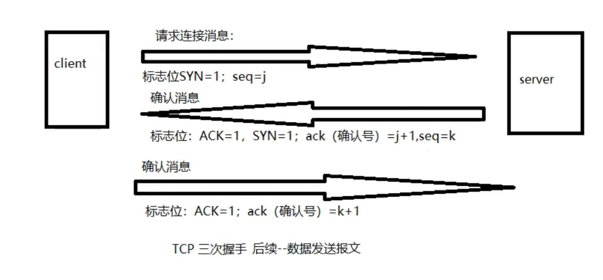
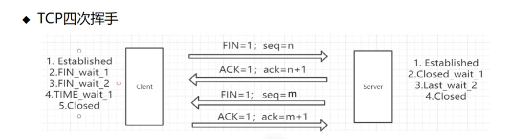

# OSI七层网络模型：

# 网络层

## ARP协议

**ARP（地址解析协议）是把 IP 地址翻译成 MAC 地址的协议**，让同一局域网内的设备能互相找到并通信

| 命令                                   | 作用                     |
| ------------------------------------ | ---------------------- |
| arp -a                               | 查看ARP表                 |
| arp -d *                             | 清空主机的ARP表              |
| netsh interface ipv4 delete arpcache | 清空本机所有 IPv4 的动态 ARP 缓存 |
| route print                          | 打印路由                   |

wireshark根据网卡进行抓包，可以过滤需要的信息

全f为广播消息

## IP协议

IP协议为互联网上的设备提供统一寻址和路由机制，确保数据能从源主机跨网络送达目标主机。

ip地址：分配给用户上网使用网际协议的设备的数字标签

ipv6：128，16进制表示

ip地址=网络号（标识子网，只有在同一个子网的主机才能直接通信）+主机号（区分子网中的主机）

路由协议：指定数据包转送方式的网上协议。静态路由和动态路由

默认路由：全0网络目标和网络掩码匹配所有

## TCP协议 ：

传输控制协议（Transmission Control Protocol）

