# 日本蜡烛图形态速查

- 图形示例: 脚本合成的示意图(橙色高亮为形态K线)
- 形态详情指标: 对照 `形态.md`
- 开仓建议: 参考《日本蜡烛图技术》(Steve Nison)标准战术

| 形态名称 | 图形示例 | 形态详情指标 | 开仓建议 |
| --- | --- | --- | --- |
| 锤子线 | 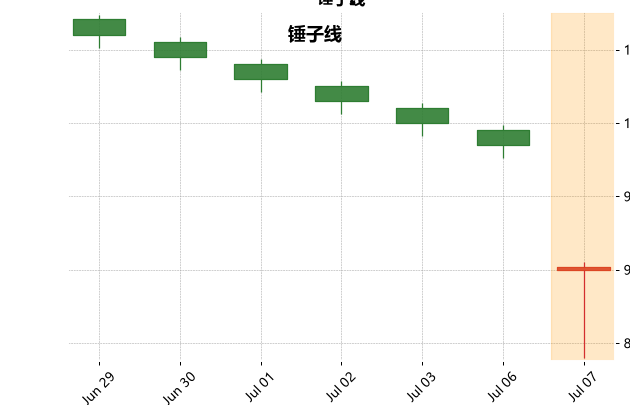 | 下跌趋势; 下影≥2×实体, 上影≤0.3×实体, 实体≤0.3×区间 | 在下影线一半或2/3处开多; 止损设于锤子线最低点下方 |
| 上吊线 | 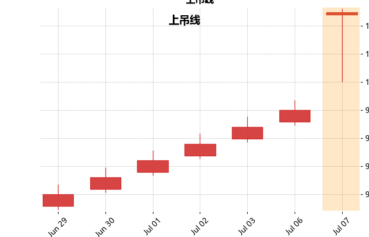 | 上涨趋势; 结构同锤子线 | 次日收阴于实体下方开空, 止损设于上吊线最高点上方; 次日收阳于实体上方开多, 止损设于上吊线最低点下方 |
| 流星线 | 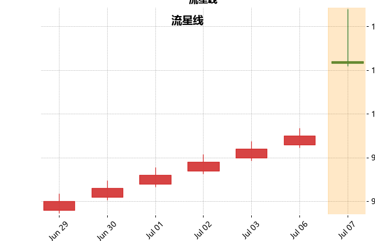 | 上涨趋势; 上影≥2×实体, 下影≤0.3×实体, 实体≤0.3×区间 | 在上影线一半或2/3处开空; 止损设于流星线上影顶端上方 |
| 倒锤子线 | 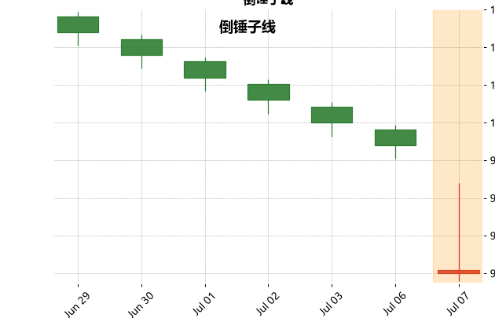 | 下跌趋势; 上影≥2×实体, 下影≤0.3×实体, 实体≤0.3×区间 | 次日阳线确认后开多; 止损设于倒锤子最低点下方 |
| 十字星 | 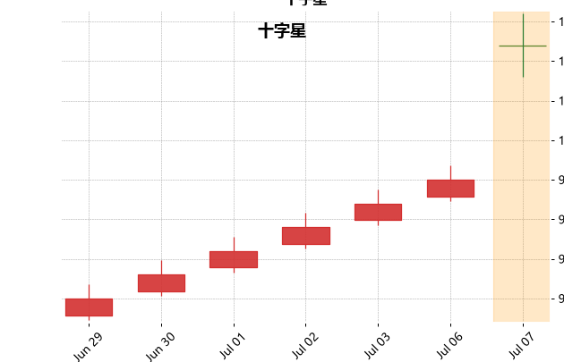 | 实体≤0.05×区间(普通/长腿/墓碑/蜻蜓) | 趋势末端预警, 次日方向确认后再开仓; 止损设于十字星区间外 |
| 大阳线 | 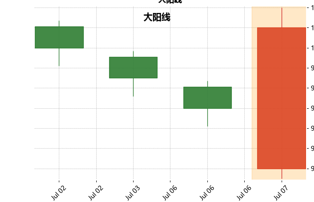 | 阳线, 实体≥0.7×区间, 且区间≥1.3×ATR(14) | 回踩实体中部开多; 止损设于大阳线最低点下方 |
| 大阴线 | 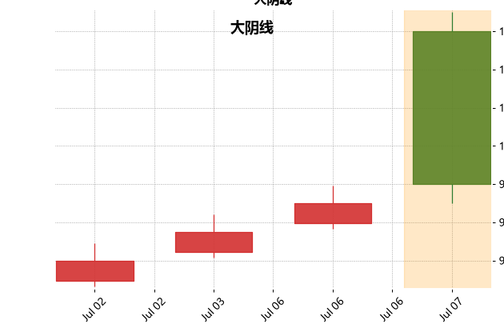 | 阴线, 实体≥0.7×区间, 且区间≥1.3×ATR(14) | 反弹至实体中部开空; 止损设于大阴线最高点上方 |
| 纺锤线 | 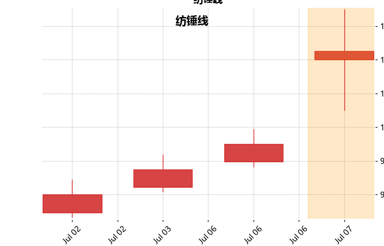 | 实体≤0.3×区间, 上下影均≥实体 | 震荡预警, 等突破方向后开仓; 止损设于纺锤区间外 |
| 看涨吞没 | 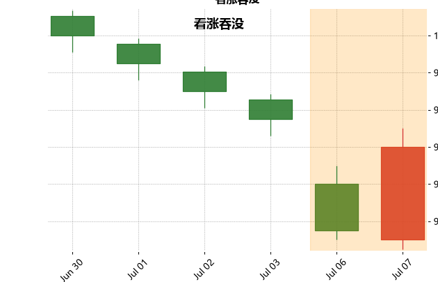 | 下跌趋势; K1阴K2阳, K2实体包裹K1实体(O2<C1, C2>O1) | 在K2实体一半或2/3处开多; 止损设于形态最低点下方 |
| 看跌吞没 | 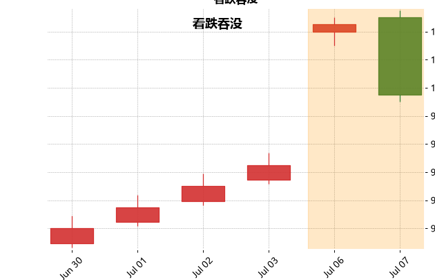 | 上涨趋势; K1阳K2阴, K2实体包裹K1实体(O2>C1, C2<O1) | 在K2实体一半或2/3处开空; 止损设于形态最高点上方 |
| 刺透形态 | 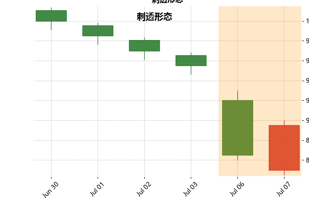 | 下跌趋势; K1大阴, K2低开创新低, 收盘过K1实体中线且<C1 | 在K2实体一半或2/3处开多; 止损设于形态最低点(前低)下方 |
| 乌云盖顶 | 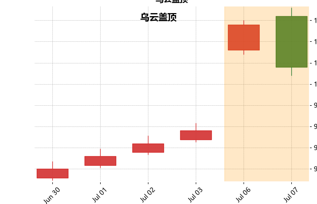 | 上涨趋势; K1大阳, K2高开创高, 收盘跌破K1实体中线且>O1 | 在K2实体一半或2/3处开空; 止损设于形态最高点(前高)上方 |
| 孕线 | 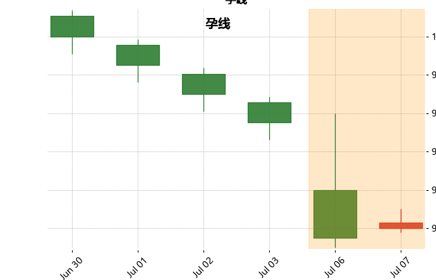 | K2实体完全嵌套K1实体; K1阳→看跌, K1阴→看涨, K1十字→中性 | 次日突破K1实体方向后开仓; 止损设于K1区间外 |
| 早晨之星 | 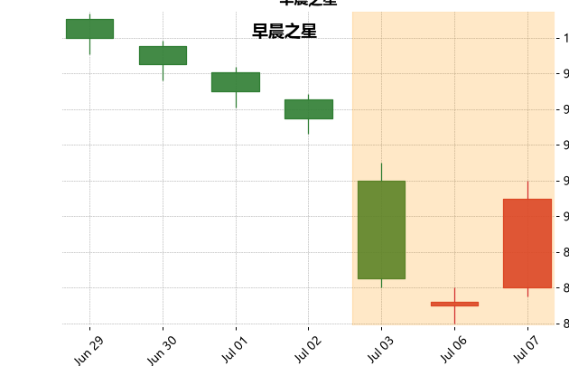 | 下跌趋势; K1大阴(区间1≥1.3×ATR)+跳空小实体+大阳刺入K1过半 | 在大阳实体一半或2/3处开多; 止损设于形态最低点(星线低点)下方 |
| 黄昏之星 | 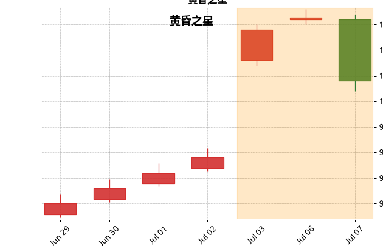 | 上涨趋势; K1大阳(区间1≥1.3×ATR)+跳空小实体+大阴刺入K1过半 | 在大阴实体一半或2/3处开空; 止损设于形态最高点(星线高点)上方 |
| 红三兵 | 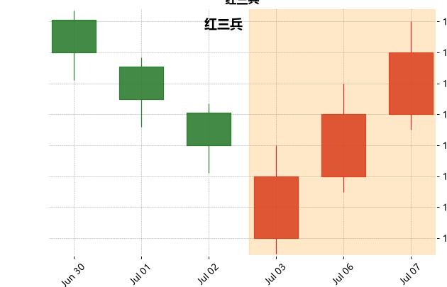 | 三连阳; 每根开盘落在前根实体内, 收盘持续新高, 上影短小 | 第三根收盘确认后, 回踩第二根中点开多; 止损设于第一根阳线下方 |
| 三乌鸦 | 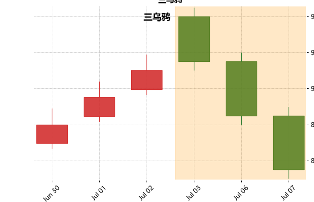 | 三连阴; 每根开盘落在前根实体内, 收盘持续新低, 下影短小 | 第三根收盘确认后, 反弹至第二根中点开空; 止损设于第一根阴线上方 |
| 上升三法 | 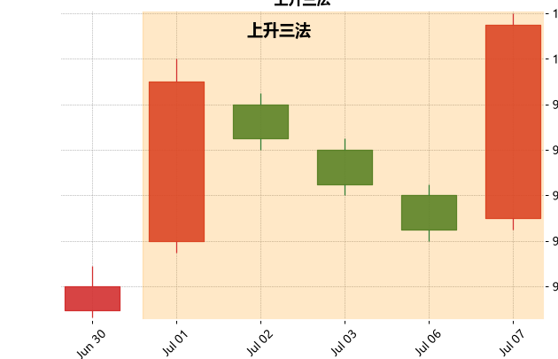 | 长阳+2~4小阴回调(全被首根包裹)+末根大阳创新高 | 末根大阳突破后, 回踩其实体中点开多; 止损设于首根长阳最低点下方 |
| 下跌三法 | 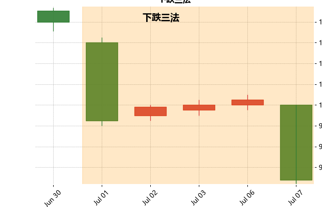 | 长阴+2~4小阳反弹(全被首根包裹)+末根大阴创新低 | 末根大阴跌破后, 反弹至其实体中点开空; 止损设于首根长阴最高点上方 |
| 向上跳空缺口 | 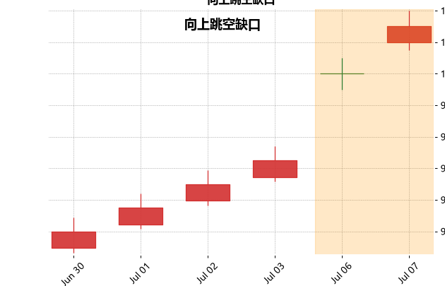 | Low2>High1, 支撑窗口 | 回踩缺口不破开多; 止损设于缺口下沿(High1)下方 |
| 向下跳空缺口 | 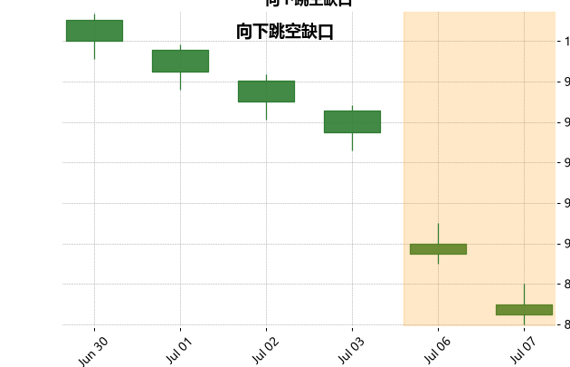 | High2<Low1, 压力窗口 | 反弹缺口不破开空; 止损设于缺口上沿(Low1)上方 |
| 岛形反转 | 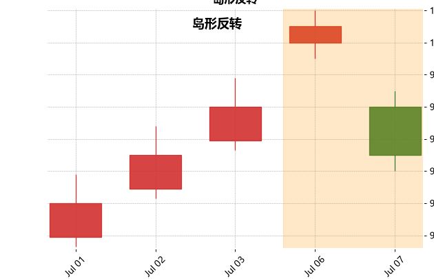 | 双向跳空+中间孤岛; 底部→多, 顶部→空 | 跳空确认后开仓(底多/顶空); 止损设于孤岛极值外 |