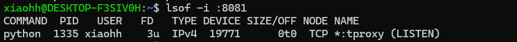
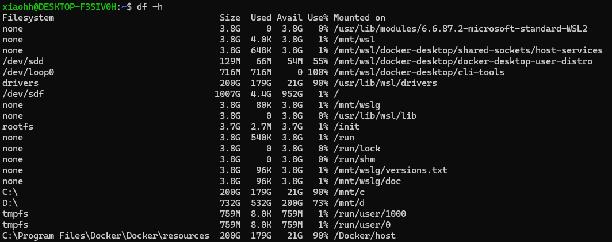
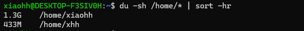
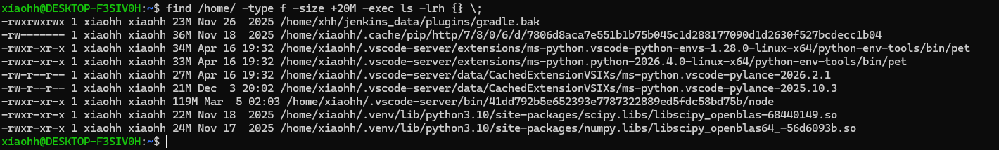

# 问答题

## 1，请写出一条命令，实时查看 app.log，只显示包含 error 或 Exception 的行，并且忽略大小写。

```
tail -f app.log | grep -iE 'error|Exception'
```

## 2，在 Linux/Unix 系统中，怎么快速定位某个端口（如 8080）被哪个进程、用户、程序占用？

```
sudo lsof -i :8080
python -m http.server 8081
```



## 3，服务器磁盘报警，`/`目录使用率100%。请写出排查步骤+关键命令。

### 1）看哪个挂载点满

```
df -h
```



### 2）看哪个目录/文件最大

```
du -sh /home/* | sort -hr
```



### 3）定位大日志/大文件

```
find /home/ -type f -size +1G -exec ls -lh {} \;
```



# 4，什么是索引？测试中为什么要关注索引？

## 1）什么是索引

索引是基于表字段构建的有序数据结构，类似 书本目录，用来快速检索数据，加快查询，但会损耗增删改性能、占用磁盘空间。

## 2）测试为何关注索引

**性能**：无索引 / 索引失效会全表扫描，查询变慢；索引过多拖慢写入，压测必explain查 SQL 执行计划。

**功能**：唯一索引限制重复数据，要校验重复提交的报错逻辑。

**边界**：隐式转换、左模糊查询等会导致索引失效，需设计用例验证业务可用性。

# 5，接口测试时，你常用哪些工具？简述一个完整的接口测试流程。

pytest工具。流程：看接口文档→设计用例→准备环境数据→pytest 自动化编写执行→提 BUG→修复回归 + 接入 CI 定时跑用例

# 6，在测试时发现：接口提示 “提交成功”，但数据库里查不到这条数据，请写出完整排查思路。

1，先看接口日志，确认是否真的执行成功

2， 精确定位数据库，排除查错库/表/环境

3， 排查事务是否提交或回滚

4， 排查唯一索引/幂等导致插入失败

5，定位原因后稳定复现问题，整理日志提交缺陷。

# 设计题

## 【短视频发布功能（抖音 / 快手类）】测试完整流程：拍摄 / 上传→编辑→发布→审核→展示，从全测试维度说明测试范围和测试重点

### 一、功能测试

1. **拍摄 & 上传**
   
   - 拍摄：前后摄像头切换、闪光灯、分段录制、暂停继续、定时拍摄、横竖屏录制；无权限时拦截相机调用。
   - 上传：支持本地视频 / 图片多选上传；校验格式（mp4/mov）、大小上限、时长限制；断点续传、超大文件分片上传；空文件 / 损坏视频上传报错拦截。

2. **视频编辑**
   
   - 剪辑：裁剪时长、分割片段、倍速播放、倒放；滤镜、特效、贴纸、字幕、背景音乐添加替换；封面选取；话题 #、定位、可见范围（公开 / 私密 / 好友可见）设置。
   - 边界：超长字幕、违规话题无法添加。

3. **发布提交**
   
   - 正常发布：参数携带封面、文案、话题、定位、权限；发布成功草稿入库；取消发布存草稿。
   - 异常：必填项空值拦截发布；重复快速点击防重复创建作品。

4. **内容审核**
   
   - 机器初审 + 人工复审：涉黄 / 涉暴 / 违规文案→审核驳回，作品私密不展示；合规内容审核通过；审核中状态主页不可见。

5. **作品展示**
   
   - 创作者侧：个人主页可查看（按设置权限）；私密视频仅自己可见。
   - 观众侧：公开发布在推荐页、话题页正常刷到；私密 / 好友限定按权限过滤。

### 二、兼容性测试

1. 机型：安卓高低配、iOS 各版本，不同分辨率、横竖屏适配；
2. 系统：安卓 10~ 安卓 15、iOS13~iOS18；
3. 客户端：APP 不同版本升级后，旧草稿正常加载发布。

### 三、性能测试

1. 上传性能：不同网速（4G/5G/WiFi/ 弱网）上传耗时、弱网丢包重试；超大视频分片上传速度；
2. 编辑性能：多特效叠加不卡顿、内存不溢出；
3. 并发性能：瞬时大量用户发布，接口无雪崩、消息队列不堆积；审核服务吞吐正常；
4. 资源占用：拍摄长时间录制 CPU / 内存不持续飙升。

### 四、安全测试

1. 上传安全：拦截恶意后缀文件、木马伪装 MP4；绕过前端限制传超大文件；
2. 权限安全：越权修改他人草稿、篡改作品可见范围；私密视频不能通过接口强制拉取；
3. 内容安全：防爬虫爬取未审核资源；文案 XSS 注入拦截。

### 五、易用性测试

1. 上传卡顿 / 失败有友好提示；编辑操作撤销 / 回退；
2. 草稿自动保存，退出重进数据不丢失；审核驳回清晰写明违规原因。

### 六、异常 & 边界测试

1. 断电 / 杀进程：上传中途退出，草稿自动保存；
2. 存储空间不足：拍摄 / 上传提示空间不足，终止操作；
3. 边界值：视频刚好最大时长、刚好最大大小，临界值可正常发布。

# 编程题

## 合并重叠区间，禁止使用 Python 内置 sort ()，需手动实现排序后再区间合并逻辑

```
from typing import List

class Solution(object):
    def merge(self, intervals: List[List[int]]) -> List[List[int]]:
        if not intervals:
            return []

        n = len(intervals)
        for i in range(n):
            for j in range(n - i - 1):
                if intervals[j][0] > intervals[j+1][0]:
                    intervals[j], intervals[j+1] = intervals[j+1], intervals[j]

        res = [intervals[0]]
        for cur in intervals[1:]:
            last = res[-1]
            if cur[0] <= last[1]:
                last[1] = max(last[1], cur[1])
            else:
                res.append(cur)
        return res
```

# 风险把控

## 基于真实的项目经历，说明在项目开展过程中，您是如何开展风险评估与质量保障活动的。

面试官您好，结合九天 Jiutian 数据处理引擎项目，我从**全周期风险评估**和**落地质量保障**两部分开展管控：

第一，分四阶段落地风险评估，提前识别隐患。

1. **需求阶段前置风控**：对接产品、算法、开发梳理算子、参数、Ray 作业生命周期规范，提前识别参数耦合、非法入参、Actor 资源异步回收三类潜在风险，录入风险台账分级管理；
2. **开发阶段过程盯控**：引擎依托 Ray 分布式架构，重点跟进算子并发逻辑、NPU/CPU 资源调度、自定义 UDF 环境依赖风险，每日晨会同步风险进度；
3. **测试阶段落地验证**：针对前期梳理风险设计专项用例，在测试中暴露三个典型问题：max_async_concurrency 与 select_columns 参数交互失效、删除作业后 Coordinator 资源残留、concurrency 传负数任务卡死，随即升级风险等级，推动开发整改；
4. **上线前预演风控**：依托预发布集群，模拟小艺真实多模态业务流量，核验多源数据接入、全链路数据输出的生产风险。所有风险划分高、中、低三档，闭环跟踪整改。

第二，分层落地质量保障，左移测试规避问题。

一是**代码质量左移**：通过静态代码扫描 + 代码评审，补齐参数全局合法性校验，从编码层面杜绝负数并发这类边界漏洞；算子逻辑、Job 删除的异步资源销毁逻辑必须经过评审。

二是**分层测试覆盖**：单元测单个算子边界场景，集成测参数联动、作业全生命周期流程，压测验证集群高负载下稳定性，针对性修复历史三类缺陷；

三是**版本与上线管控**：把历史 bug 沉淀到用例库，重构版本专项回归历史风险点；上线采用灰度对接小艺业务，实时监控任务运行与集群资源。

最后，项目定期复盘缺陷，反向优化需求、编码、测试规范，形成风险 - 缺陷 - 优化的闭环，保障引擎稳定支撑小艺多模态数据处理。
